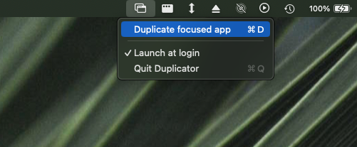
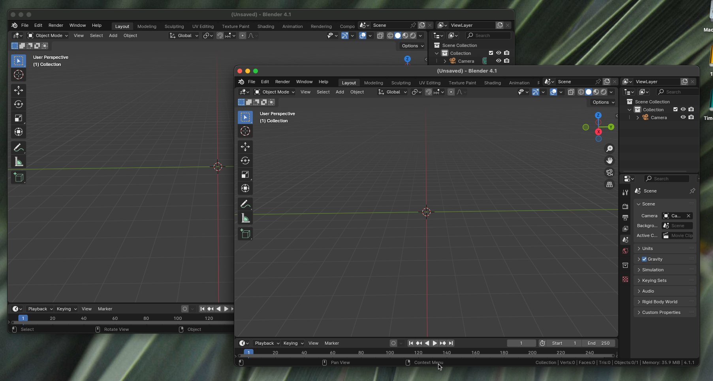

# Duplicator 

macOS menu bar app to quickly create a new instance of the focused application. This is useful for applications that you may want to have multiple windows of, but the application doesn't support it, such as Blender.

***

 

 
 

### Requirements

- macOS 13+

### Limitations

Some apps will only allow one instance at a time and quit if a new instance is launched, such as Visual Studio Code (although Visual Studio Code has a New Window function).